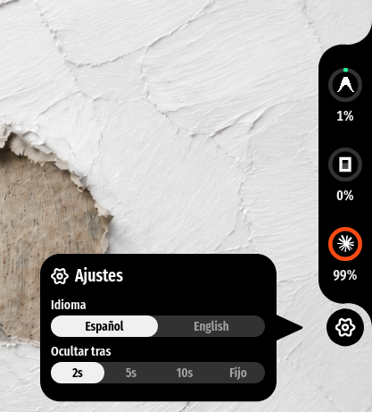
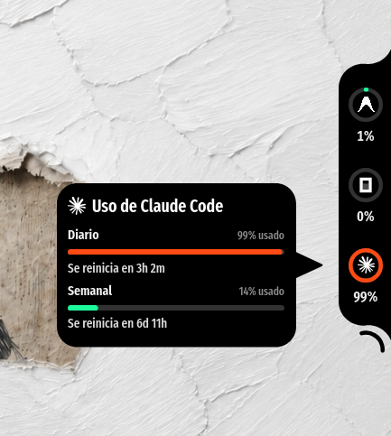
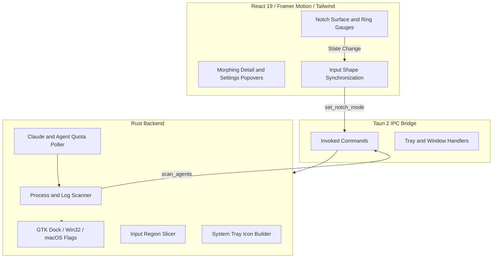

<p align="center">
  
</p>

<h1 align="center">Rimarc</h1>

<p align="center">
  <strong>Native desktop Dynamic Island and Dock for real-time AI Agent session monitoring.</strong>
</p>

<p align="center">
  <a href="https://github.com/tauri-apps/tauri"></a>
  <a href="https://react.dev/"></a>
  <a href="https://www.rust-lang.org/"></a>
  <a href="https://www.typescriptlang.org/"></a>
  <a href="https://github.com/Jhongdlp/Rimarc/releases"></a>
  <a href="LICENSE"></a>
</p>

---

## Overview

**Rimarc** is a non-intrusive, persistent desktop overlay dock engineered for developers running autonomous AI coding agents such as Claude Code, OpenAI Codex, Google Antigravity, OpenCode, and Aider.

Anchored to the screen edge, Rimarc operates as a native system widget. It provides real-time telemetry on token limits, context utilization, daily and weekly burn rates, and active workspace paths without window switching or interrupting active workflows.

---

## Interface

<div align="center">
  <table>
    <tr>
      <td align="center" width="22%">
        <strong>Minimalist Dock</strong><br/><br/>
        <br/>
        <em>Live quota gauges and status indicators</em>
      </td>
      <td align="center" width="45%">
        <strong>Agent Telemetry Popover</strong><br/><br/>
        <br/>
        <em>Context size, quotas, and terminal shortcuts</em>
      </td>
      <td align="center" width="33%">
        <strong>Morphing Preferences</strong><br/><br/>
        <br/>
        <em>Continuous S-curve settings panel</em>
      </td>
    </tr>
  </table>
</div>

---

## Core Capabilities

### Native Desktop Integration
* **Dock Window Type Hint**: Configured directly through the window compositor to prevent inclusion in the `Alt + Tab` application switcher.
* **Multi-Workspace Pinning**: Persists consistently across virtual desktops and multiple display configurations.
* **Input Region Masking**: Dynamic shape masking ensures transparent areas allow full click-through to underlying applications.

### Background Service and System Tray
* **Daemon Execution**: Operates quietly in the system tray with minimal resource overhead.
* **Quick Toggle**: Left-click the tray icon to collapse or reveal the dock instantly.
* **Resource Efficient**: Maintains a memory profile under 15 MB RAM with negligible CPU impact during idle state.

### Geometric Precision and Motion
* **Continuous S-Curve Fillets**: Dock contours and popover pointers use exact tangent circular fillets ($R = 0.45 \times \text{width}$, $96.38^\circ$ sweep angle) generated via dynamic SVG paths.
* **Spring Dynamics**: Smooth transitions powered by Framer Motion.
* **Auto-Hide Control**: Configurable collapse presets (2s, 5s, 10s, or pinned).

### Multi-Agent Process Discovery
Automatic local session and process scanning support:
* **Claude Code** (Anthropic): Real-time 5-hour session quota and daily utilization tracking.
* **OpenAI Codex / CLI**: Local process state and session monitoring.
* **Google Antigravity**: Subagent tracking and workspace discovery.
* **OpenCode / Aider**: CLI background process detection.

---

## Installation

### Binary Packages

Download ready-to-run packages from the [Releases](https://github.com/Jhongdlp/Rimarc/releases) page:

| Operating System | Package Type | Installation Command / Action |
|---|---|---|
| Linux (Ubuntu / Debian) | `.deb` | `sudo dpkg -i Rimarc_*_amd64.deb` |
| Linux (Universal) | `.AppImage` | `chmod +x Rimarc-*.AppImage && ./Rimarc-*.AppImage` |
| Windows | `.exe` / `.msi` | Standard installer wizard with auto-startup options |
| Linux (Arch) | `PKGBUILD` | `cd packaging && makepkg -si` |
| macOS | `.dmg` | Drag to Applications (Apple Silicon & Intel supported) |

### Updates

Rimarc checks for a new release on launch and installs it silently, then restarts.
This only works for bundles the updater can replace in place:

| Package | Auto-updates | How it updates |
|---|---|---|
| Windows `.exe` / `.msi` | Yes | Built in, on launch |
| Linux `.AppImage` | Yes | Built in, on launch |
| macOS `.app` | Yes | Built in, on launch |
| Linux `.deb` / `.rpm` | No | Reinstall the new package by hand |
| Arch `rimarc-bin` | No | `cd packaging && makepkg -si` |

Distro packages own files under `/usr`, so the app cannot rewrite itself there.
Use the AppImage if you want a Linux build that keeps itself current.

---

### Building From Source

#### Requirements
1. **Node.js** (v18+) and **pnpm**
2. **Rust** toolchain (`stable`)
3. **Linux Build Dependencies** (Debian/Ubuntu systems):
   ```bash
   sudo apt-get update
   sudo apt-get install -y libwebkit2gtk-4.1-dev libappindicator3-dev librsvg2-dev patchelf libayatana-appindicator3-dev
   ```

#### Build Steps

1. Clone the repository:
   ```bash
   git clone https://github.com/Jhongdlp/Rimarc.git
   cd Rimarc
   ```

2. Install dependencies:
   ```bash
   pnpm install
   ```

3. Run in development mode:
   ```bash
   pnpm tauri dev
   ```

4. Build production distribution:
   ```bash
   pnpm tauri build --bundles deb
   ```

---

## Architecture



---

## Configuration

Settings can be accessed directly from the gear icon at the base of the dock:

| Option | Values | Purpose |
|---|---|---|
| Auto-Hide | `2s`, `5s` (default), `10s`, `Pinned` | Inactivity interval before collapsing into peek mode. |
| Terminal Emulator | `Auto`, `Ghostty`, `Warp`, `Alacritty`, `Kitty`, `Konsole` | Preferred terminal binary for opening agent directories. |
| Language | `Español`, `English` | User interface localization. |

---

## Contributing

1. Fork the repository.
2. Create a feature branch (`git checkout -b feature/improvement`).
3. Commit changes (`git commit -m 'feat: add support for new agent'`).
4. Push to the branch (`git push origin feature/improvement`).
5. Open a Pull Request.

---

## License

This project is licensed under the MIT License. See [LICENSE](LICENSE) for details.
